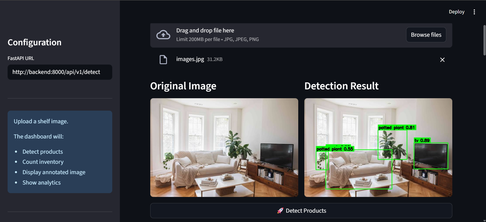
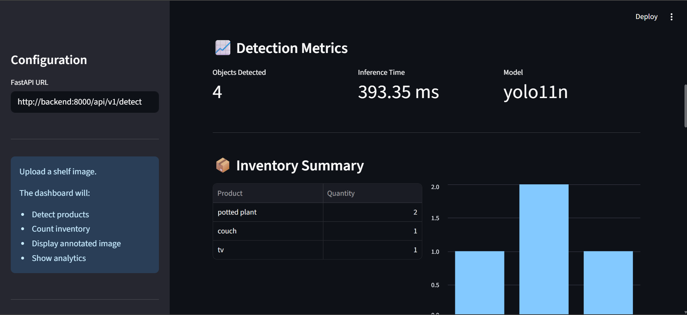
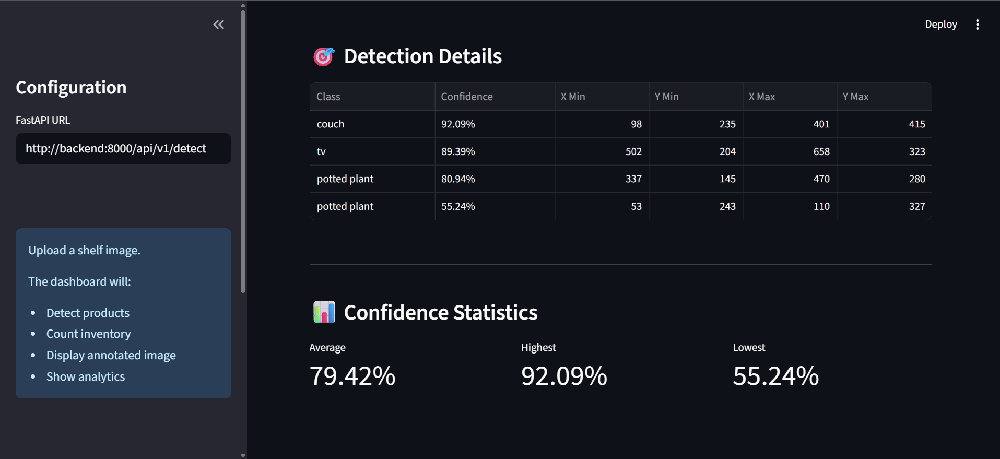
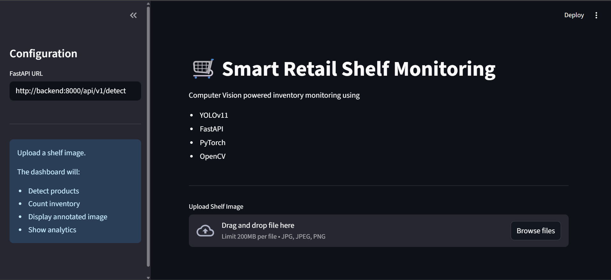
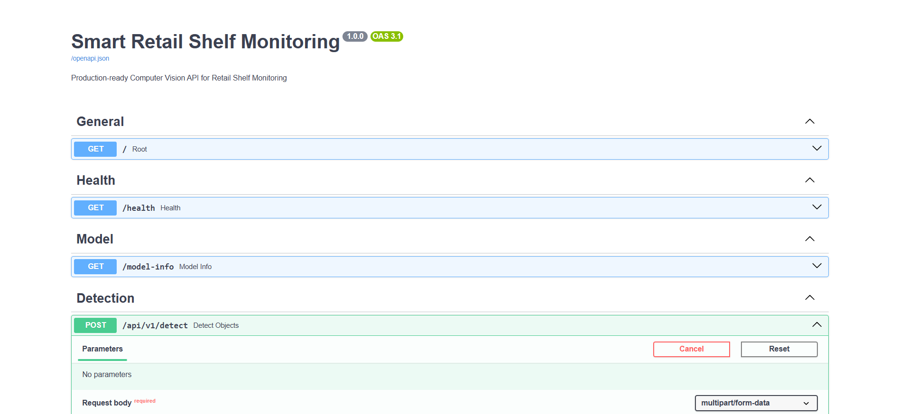
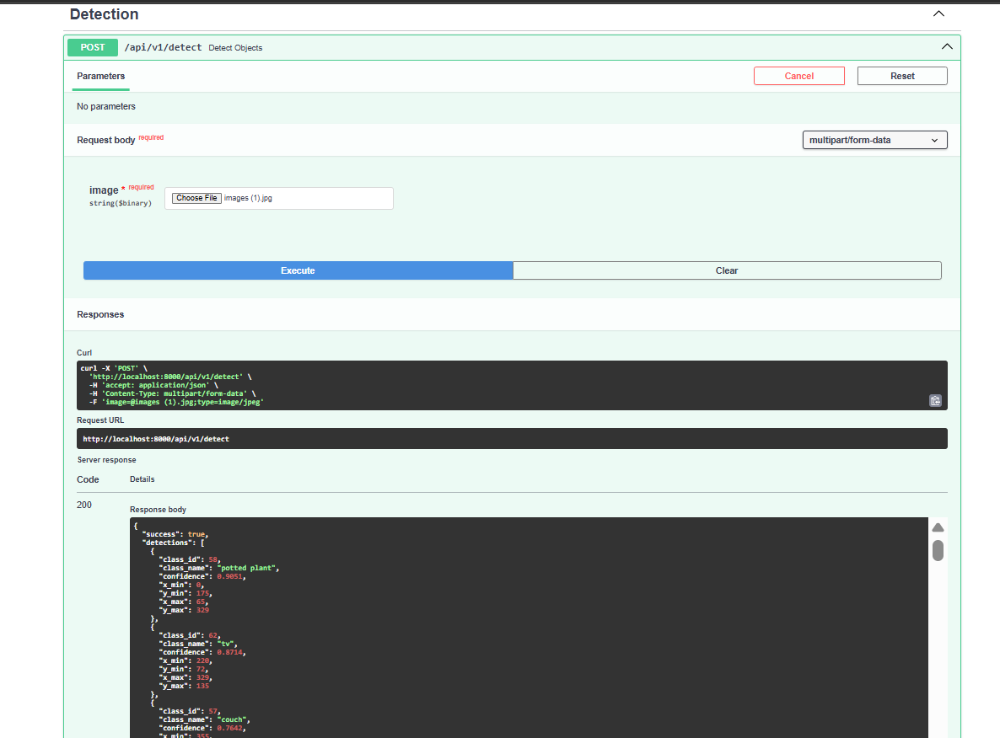

# 🛒 Smart Retail Shelf Monitoring System


A production-inspired Computer Vision application for automated retail inventory monitoring using **YOLOv11**, **FastAPI**, **PyTorch**, **OpenCV**, and **Streamlit**.

The system detects objects in shelf images, annotates them with bounding boxes, summarizes inventory counts, and exposes the functionality through a REST API and an interactive dashboard.

---
## Project Highlights

- Built an end-to-end Computer Vision system using YOLOv11 and PyTorch
- Developed a modular FastAPI backend with service-oriented architecture
- Created an interactive Streamlit dashboard for inventory analytics
- Containerized the application using Docker and Docker Compose
- Demonstrates model serving, API development, frontend integration, and deployment

## Detection Result




## Features

- Real-time object detection using YOLOv11
- Automated inventory counting and summarization
- FastAPI REST API with structured responses
- Interactive Streamlit dashboard
- Annotated image generation and visualization
- Health monitoring and model information endpoints
- Dockerized deployment with Docker Compose
- Modular and scalable service-oriented architecture

# Architecture

```
                         +------------------+
                         |      User        |
                         +------------------+
                                  │
                                  ▼
                     +-------------------------+
                     |  Streamlit Dashboard    |
                     |      (Frontend UI)      |
                     +-------------------------+
                                  │
                           HTTP Request
                                  │
                                  ▼
                     +-------------------------+
                     |     FastAPI Backend     |
                     |      (REST API)         |
                     +-------------------------+
                                  │
                                  ▼
               +--------------------------------------+
               |      ShelfMonitoringService          |
               +--------------------------------------+
                    │             │              │
                    ▼             ▼              ▼
          +---------------+ +-------------+ +-------------+
          |  YOLO Engine  | | Item Counter| |Response     |
          | (Detection)   | | (Counting)  | | Formatter   |
          +---------------+ +-------------+ +-------------+
                    │             │              │
                    └─────────────┴──────────────┘
                                  │
                                  ▼
                     +-------------------------+
                     |     JSON Response       |
                     +-------------------------+
                                  │
                                  ▼
                     +-------------------------+
                     |  Streamlit Dashboard    |
                     |   Displays Results      |
                     +-------------------------+
```

---

# Folder Structure

```text
smart-retail-shelf-monitor/

├── config/
│   └── model_config.yaml
│
├── sample_images/
│
├── src/
│   ├── api/
│   ├── core/
│   ├── frontend/
│   ├── models/
│   ├── services/
│   ├── utils/
│   └── main.py
│
├── tests/
    └── test_api.py
│
├── Dockerfile
├── docker-compose.yml
├── .env.example
├── requirements.txt
└── README.md
└── LICENSE

```

---

# Tech Stack

| Component | Technology |
|------------|------------|
| Language | Python |
| Deep Learning | PyTorch |
| Detection Model | YOLOv11 |
| Backend | FastAPI |
| Frontend | Streamlit |
| Image Processing | OpenCV |
| Data Models | Pydantic |
| Containerization | Docker |

---

# Installation

Clone the repository.

```bash
git clone https://github.com/Om-Suman/Smart_Retail_shelf_monitor

cd smart-retail-shelf-monitor
```

Create a virtual environment.

```bash
python -m venv venv
```

Activate it.

Windows

```bash
venv\Scripts\activate
```

Linux / macOS

```bash
source venv/bin/activate
```

Install dependencies.

```bash
pip install -r requirements.txt
```

## Environment Variables

Create a `.env` file in the project root:

```env
MODEL_PATH=yolo11n.pt
CONF_THRESHOLD=0.35
IOU_THRESHOLD=0.45
API_HOST=0.0.0.0
API_PORT=8000
ENV=development
```

Run the backend.

```bash
python -m uvicorn src.main:app --reload
```

Run Streamlit.

```bash
streamlit run src/frontend/dashboard.py
```

---

# Docker

Build the application.

```bash
docker compose up --build
```

Backend

```
http://localhost:8000
```

Swagger

```
http://localhost:8000/docs
```

Dashboard

```
http://localhost:8501
```

---

# API Endpoints

## Health

```
GET /health
```

Returns backend status and active device.

---

## Model Information

```
GET /model-info
```

Returns loaded model details.

---

## Detection

```
POST /api/v1/detect
```

Accepts a JPEG or PNG image and returns

- Detected objects
- Inventory summary
- Annotated image
- Metadata

---

# Example Response

```json
{
  "success": true,
  "detections": [...],
  "inventory": {
    "total_objects": 4,
    "products": [...]
  },
  "annotated_image": "...",
  "metadata": {
    "model_name": "yolo11n",
    "inference_time_ms": 18.3
  }
}
```

---

# Future Improvements

- Retail-specific model fine-tuning
- Batch image inference
- Video analytics
- Webcam support
- PDF inventory reports
- CSV export
- Real-time monitoring
- Model version management

---

# Screenshots

## Dashboard



## Swagger UI




---

# License

This project is licensed under the MIT License.

See the [LICENSE](LICENSE) file for details.