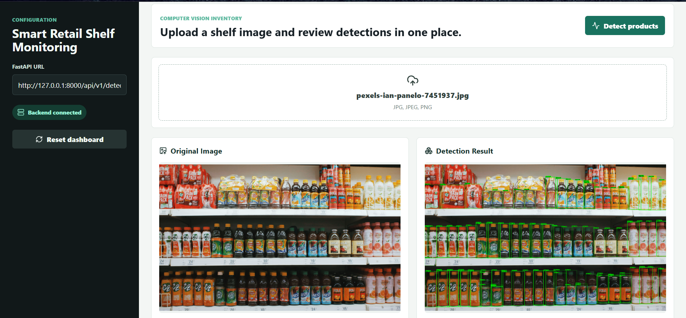
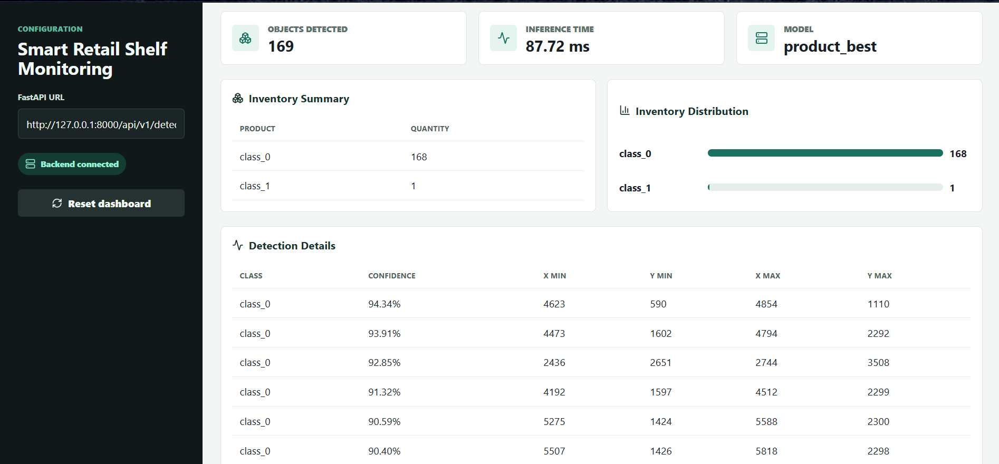
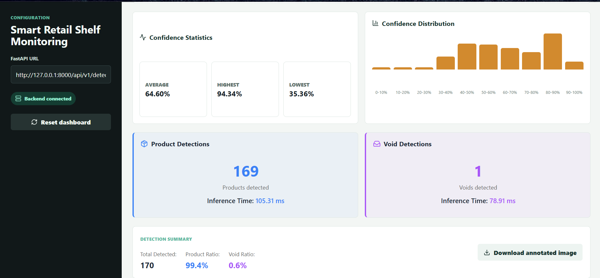
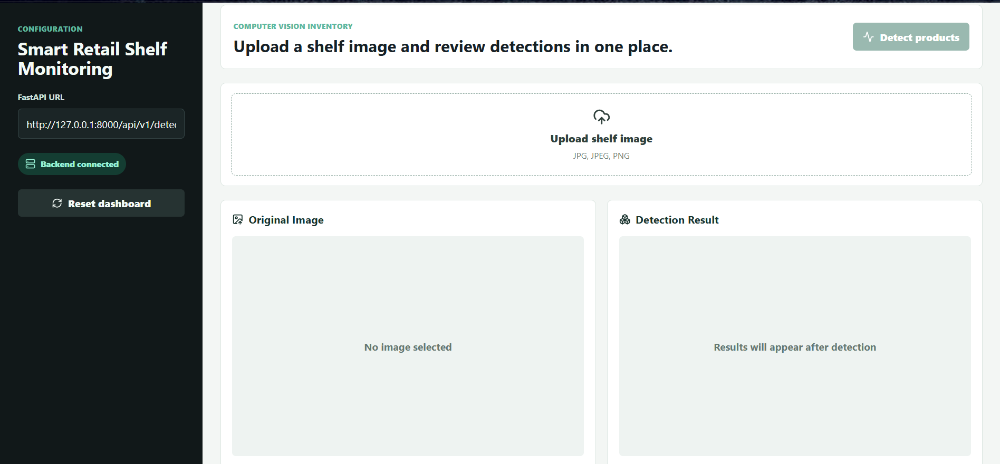
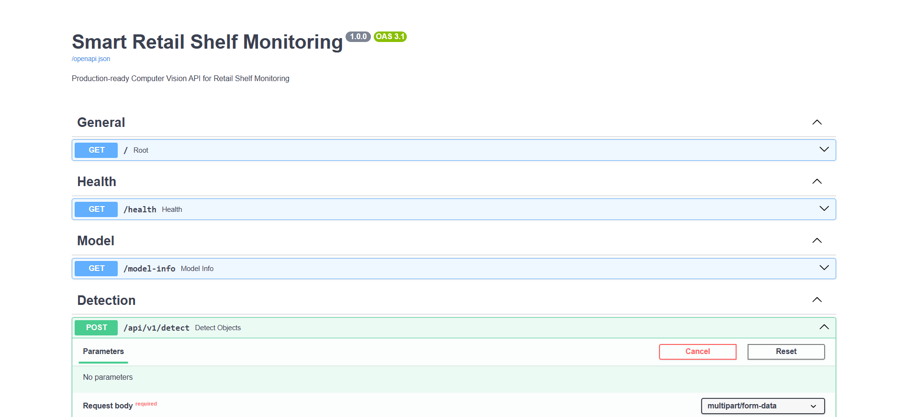
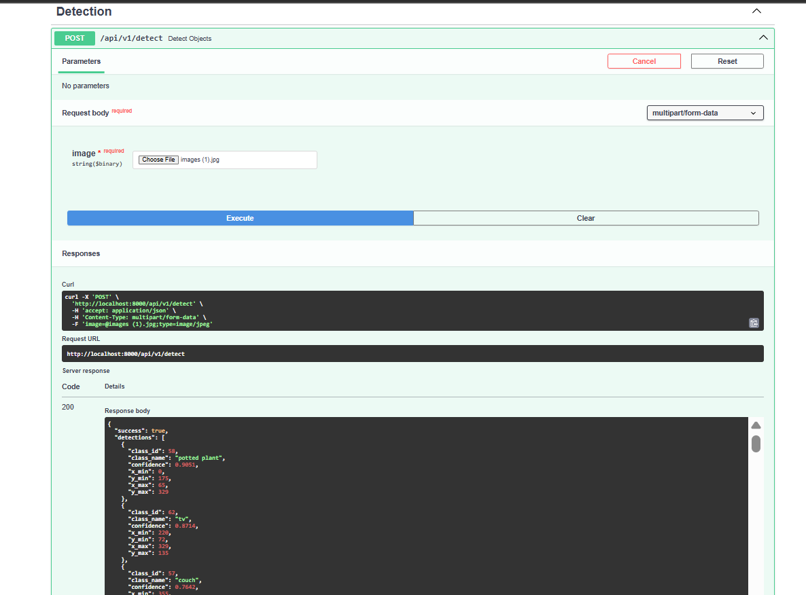

# 🛒 Smart Retail Shelf Monitoring System


> **An end-to-end Computer Vision system for automated retail shelf monitoring, object detection, and inventory analysis.**

Smart Retail Shelf Monitoring System is a Computer Vision application that uses **YOLOv11**, **PyTorch**, **OpenCV**, **FastAPI**, and **React** to analyze retail shelf images.

The system detects objects from uploaded shelf images, generates annotated images with bounding boxes, calculates inventory counts, and presents the results through an interactive web dashboard.

---

# 📌 Table of Contents

* [Overview](#-overview)
* [Key Features](#-key-features)
* [How It Works](#-how-it-works)
* [Architecture](#-architecture)
* [Tech Stack](#-tech-stack)
* [Project Structure](#-project-structure)
* [Detection Results](#-detection-results)
* [API](#-api)
* [Installation](#-installation)
* [Environment Variables](#-environment-variables)
* [Running the Application](#-running-the-application)
* [Docker](#-docker)
* [Testing](#-testing)
* [Screenshots](#-screenshots)
* [Next Task](#-next-task)
* [License](#-license)

---

# 🔎 Overview

Retail stores need to continuously monitor product availability and shelf conditions. Manual inspection can be time-consuming and difficult to scale.

This project automates the object detection and inventory-counting part of that process using Computer Vision.

### The system can:

1. Accept a shelf image from the React frontend.
2. Send the image to the FastAPI backend.
3. Run YOLOv11 inference using PyTorch.
4. Detect objects and calculate confidence scores.
5. Count detected objects by class.
6. Generate an annotated image.
7. Return structured JSON data.
8. Display the results in the React dashboard.

### High-Level Workflow

```text
Shelf Image
     │
     ▼
React Dashboard
     │
     │ HTTP Request
     ▼
FastAPI Backend
     │
     ▼
ShelfMonitoringService
     │
     ├───────────────┐
     ▼               ▼
YOLOv11          Image Processing
Inference        & Annotation
     │               │
     └───────┬───────┘
             ▼
      Inventory Counter
             │
             ▼
      Response Formatter
             │
             ▼
        JSON Response
             │
             ▼
       React Dashboard
```

---

# ✨ Key Features

## Computer Vision

* YOLOv11-based object detection
* Configurable confidence threshold
* Configurable IoU threshold
* Bounding-box visualization
* Detection confidence scores
* Automated object counting
* Inventory summarization
* Annotated image generation

## Backend

* FastAPI REST API
* Pydantic request/response models
* Modular service-oriented architecture
* Centralized configuration
* Logging and exception handling
* Health-check endpoint
* Model-information endpoint
* Structured API responses

## Frontend

* React + Vite dashboard
* Image upload interface
* Detection result visualization
* Inventory summary
* Detection metadata
* Annotated image preview
* Result download support

## Deployment

* Dockerized application
* Docker Compose support
* Environment-based configuration
* Separate frontend and backend services

---

# 🧠 How It Works

## 1. Image Upload

The user uploads a shelf image through the React dashboard.

Supported formats:

```text
JPEG
PNG
```

---

## 2. API Request

The frontend sends the image to the FastAPI backend:

```http
POST /api/v1/detect
```

The backend receives and validates the uploaded image.

---

## 3. YOLOv11 Inference

The image is passed to the YOLOv11 detection engine.

The model generates detections containing information such as:

```text
Class
Confidence
Bounding Box
```

Example:

```text
Product A → 0.91
Product B → 0.87
Product A → 0.84
Product C → 0.79
```

---

## 4. Inventory Counting

The detected objects are processed by the inventory counter.

Example:

```text
Total Objects: 4

Product A: 2
Product B: 1
Product C: 1
```

---

## 5. Image Annotation

OpenCV is used to generate an annotated version of the input image.

The generated image contains:

* Bounding boxes
* Class labels
* Confidence scores

---

## 6. API Response

The backend returns a structured JSON response containing:

* Detection results
* Inventory summary
* Annotated image
* Model information
* Inference time
* Metadata

---

## 7. Dashboard Visualization

The React frontend receives the response and presents the detection and inventory results through the dashboard.

---

# 🏗️ Architecture

```text
                         ┌──────────────────┐
                         │      User        │
                         └────────┬─────────┘
                                  │
                                  ▼
                    ┌─────────────────────────┐
                    │     React Dashboard     │
                    │       Frontend          │
                    └────────────┬────────────┘
                                 │
                              HTTP
                                 │
                                 ▼
                    ┌─────────────────────────┐
                    │     FastAPI Backend     │
                    │       REST API          │
                    └────────────┬────────────┘
                                 │
                                 ▼
                 ┌──────────────────────────────┐
                 │   ShelfMonitoringService     │
                 └──────────────┬───────────────┘
                                │
              ┌─────────────────┼─────────────────┐
              │                 │                 │
              ▼                 ▼                 ▼
      ┌──────────────┐  ┌──────────────┐  ┌──────────────┐
      │   YOLOv11    │  │    Object    │  │    Image     │
      │   Detector   │  │    Counter   │  │  Processing  │
      └──────┬───────┘  └──────┬───────┘  └──────┬───────┘
             │                 │                 │
             └─────────────────┼─────────────────┘
                               ▼
                    ┌─────────────────────────┐
                    │   Response Formatter    │
                    └────────────┬────────────┘
                                 │
                                 ▼
                         JSON Response
                                 │
                                 ▼
                    ┌─────────────────────────┐
                    │     React Dashboard     │
                    │    Results & Analytics  │
                    └─────────────────────────┘
```

---

# 🛠️ Tech Stack

| Layer                | Technology                   |
| -------------------- | ---------------------------- |
| Programming Language | Python 3.11                  |
| Deep Learning        | PyTorch                      |
| Object Detection     | YOLOv11                      |
| Backend              | FastAPI                      |
| API Validation       | Pydantic                     |
| Image Processing     | OpenCV                       |
| Frontend             | React                        |
| Frontend Tooling     | Vite                         |
| Containerization     | Docker                       |
| Orchestration        | Docker Compose               |
| Testing              | Pytest                       |
| Configuration        | YAML / Environment Variables |

---

# 📁 Project Structure

```text
smart-retail-shelf-monitor/
│
├── config/
│   └── model_config.yaml
│
├── sample_images/
│   ├── detection1.png
│   ├── detection2.png
│   ├── detection3.png
│   ├── dashboard.png
│   ├── swagger_ui1.png
│   └── swagger_ui2.png
│
├── src/
│   ├── api/
│   │   ├── routes/
│   │   ├── dependencies/
│   │   ├── middleware/
│   │   └── exception_handlers/
│   │
│   ├── core/
│   │   ├── config/
│   │   ├── logging/
│   │   └── exceptions/
│   │
│   ├── models/
│   │   └── schemas/
│   │
│   ├── services/
│   │   ├── detection/
│   │   ├── counting/
│   │   └── response/
│   │
│   ├── utils/
│   │   └── image_processing/
│   │
│   ├── app_factory.py
│   └── main.py
│
├── frontend/
│   ├── src/
│   │   ├── api/
│   │   ├── components/
│   │   ├── config/
│   │   ├── hooks/
│   │   ├── utils/
│   │   ├── App.jsx
│   │   └── main.jsx
│   │
│   ├── package.json
│   └── vite.config.js
│
├── tests/
│   └── test_api.py
│
├── Dockerfile
├── docker-compose.yml
├── requirements.txt
├── .env.example
├── README.md
└── LICENSE
```

---

# 📊 Detection Results

The system generates annotated shelf images with detected objects, bounding boxes, labels, and confidence scores.

### Detection Example 1



### Detection Example 2



### Detection Example 3



---

# 🔌 API

The application exposes a REST API through FastAPI.

Interactive API documentation is available through Swagger UI.

## Health Check

```http
GET /health
```

Returns backend health information and the active inference device.

---

## Model Information

```http
GET /model-info
```

Returns information about the currently loaded YOLO model.

Example:

```json
{
  "model_name": "yolo11n",
  "device": "cpu"
}
```

---

## Object Detection

```http
POST /api/v1/detect
```

### Request

The endpoint accepts an image using multipart form-data:

```text
image: <JPEG or PNG file>
```

### Response

The endpoint returns:

* Detected objects
* Bounding boxes
* Confidence scores
* Inventory counts
* Annotated image
* Model metadata
* Inference time

---

# 📦 Example API Response

```json
{
  "success": true,
  "detections": [
    {
      "class_name": "product",
      "confidence": 0.91,
      "bbox": [120, 85, 245, 310]
    }
  ],
  "inventory": {
    "total_objects": 4,
    "products": [
      {
        "name": "product",
        "count": 4
      }
    ]
  },
  "annotated_image": "...",
  "metadata": {
    "model_name": "yolo11n",
    "inference_time_ms": 18.3
  }
}
```

---

# ⚙️ Installation

## 1. Clone the Repository

```bash
git clone https://github.com/Om-Suman/Smart_Retail_shelf_monitor.git

cd Smart_Retail_shelf_monitor
```

---

## 2. Create a Virtual Environment

```bash
python -m venv venv
```

### Windows

```bash
venv\Scripts\activate
```

### Linux / macOS

```bash
source venv/bin/activate
```

---

## 3. Install Python Dependencies

```bash
pip install -r requirements.txt
```

---

# 🔐 Environment Variables

Create a `.env` file in the project root.

```env
MODEL_PATH=yolo11n.pt
CONF_THRESHOLD=0.35
IOU_THRESHOLD=0.45

API_HOST=0.0.0.0
API_PORT=8000

ENV=development
```

### Configuration

| Variable         | Description                  | Example       |
| ---------------- | ---------------------------- | ------------- |
| `MODEL_PATH`     | YOLO model path              | `yolo11n.pt`  |
| `CONF_THRESHOLD` | Minimum detection confidence | `0.35`        |
| `IOU_THRESHOLD`  | IoU threshold                | `0.45`        |
| `API_HOST`       | Backend host                 | `0.0.0.0`     |
| `API_PORT`       | Backend port                 | `8000`        |
| `ENV`            | Application environment      | `development` |

---

# ▶️ Running the Application

## Backend

From the project root:

```bash
python -m uvicorn src.main:app --reload
```

Backend:

```text
http://localhost:8000
```

Swagger UI:

```text
http://localhost:8000/docs
```

---

# 💻 Frontend

Open another terminal:

```bash
cd frontend
```

Install dependencies:

```bash
npm install
```

Build the application:

```bash
npm run build
```

Run the production preview:

```bash
npm run preview
```

Dashboard:

```text
http://localhost:4173
```

---

# 🐳 Docker

The application can also be run using Docker Compose.

### Build and start the application

```bash
docker compose up --build
```

### Run in detached mode

```bash
docker compose up -d --build
```

### Stop the application

```bash
docker compose down
```

### Services

| Service         | URL                          |
| --------------- | ---------------------------- |
| FastAPI Backend | `http://localhost:8000`      |
| Swagger UI      | `http://localhost:8000/docs` |
| React Dashboard | `http://localhost:4173`      |

---

# 🧪 Testing

API tests are located in:

```text
tests/test_api.py
```

Run the test suite:

```bash
pytest
```

For verbose output:

```bash
pytest -v
```

---

# 🖥️ Screenshots

## React Dashboard



## Swagger UI





---

# 🎯 Next Task: Fine-Tuning YOLOv11 for Retail

The next major task for this project is to **fine-tune the YOLOv11 model on a retail-specific dataset**.

The current system uses a pretrained YOLOv11 model for object detection. Fine-tuning will adapt the model to the specific characteristics of retail shelf environments and improve its ability to detect relevant products.

### Planned Fine-Tuning Workflow

```text
Retail Dataset
      │
      ▼
Data Collection
      │
      ▼
Image Annotation
      │
      ▼
Train / Validation / Test Split
      │
      ▼
YOLO Dataset Configuration
      │
      ▼
YOLOv11 Fine-Tuning
      │
      ▼
Model Evaluation
      │
      ├── Precision
      ├── Recall
      ├── mAP@50
      └── mAP@50-95
      │
      ▼
Best Model Weights
      │
      ▼
FastAPI Integration
      │
      ▼
React Dashboard
```

### Fine-Tuning Objectives

* Collect a retail-specific shelf dataset.
* Annotate products using bounding boxes.
* Prepare the dataset in YOLO format.
* Split the dataset into training, validation, and test sets.
* Fine-tune YOLOv11 using pretrained weights.
* Evaluate the fine-tuned model using precision, recall, and mAP.
* Compare the fine-tuned model against the current pretrained model.
* Replace the current model weights with the fine-tuned model.
* Validate detection and inventory counting through the existing FastAPI and React application.

### Expected Outcome

The objective is to develop a **retail-specific YOLOv11 model** capable of more accurately detecting products in shelf images and providing more reliable inventory counts.

This fine-tuned model will then become the primary detection model used by the existing application.

---

# 📄 License

This project is licensed under the **MIT License**.

See [`LICENSE`](LICENSE) for more information.
