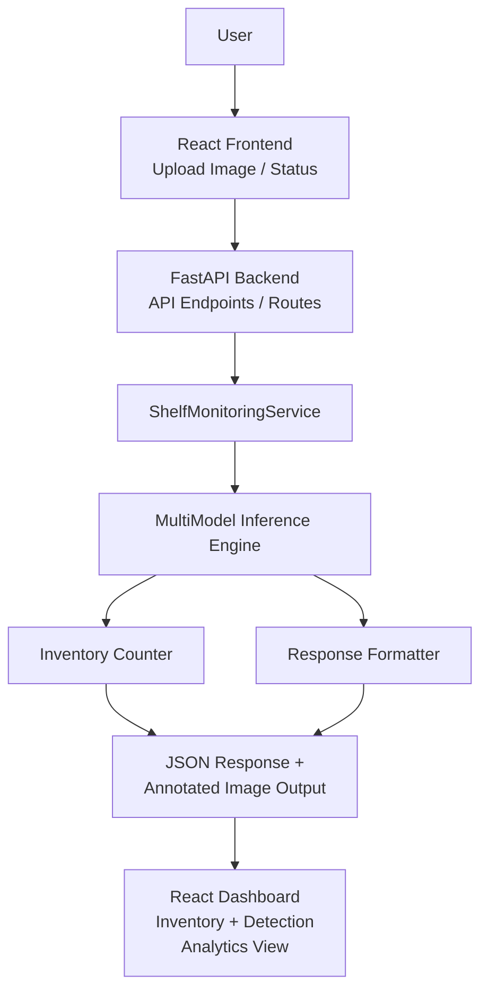

# Smart Retail Shelf Monitoring

<p align="center">
  
  
  
  
  
</p>

<p align="center">
  <strong>Retail shelf monitoring with AI-powered detection, inventory analytics, and a live dashboard.</strong>
</p>

A full-stack computer vision system for monitoring retail shelves, detecting products, and summarizing inventory from uploaded shelf images.

## Overview

This project combines:

- a FastAPI backend for image processing and YOLO inference
- a React + Vite dashboard for image upload and result viewing
- a multi-model detection workflow for retail shelf analysis
- inventory counting and annotated image generation

The app accepts a shelf image, runs inference, combines the detection results, and returns a structured JSON payload with inventory metrics and a visualized output image.

---

## Features

- Upload JPEG and PNG shelf images
- Run AI-based shelf detection
- Detect objects and shelf anomalies
- Generate annotated output images with bounding boxes
- Summarize product quantity and inventory trends
- Display detailed analytics in the React dashboard
- Expose health and model status endpoints for monitoring

---

## Architecture


```mermaid
flowchart TD
    A[User] --> B[React Frontend<br/>Upload Image / Status]
    B --> C[FastAPI Backend<br/>API Endpoints / Routes]
    C --> D[ShelfMonitoringService]
    D --> E[MultiModel Inference Engine]
    E --> F[Inventory Counter]
    E --> G[Response Formatter]
    F --> H[JSON Response +<br/>Annotated Image Output]
    G --> H
    H --> I[React Dashboard<br/>Inventory + Detection<br/>Analytics View]
```

This follows the same flow as the project diagram: user input → frontend → FastAPI backend → detection and inventory services → response payload → dashboard visualization.

---

## Features Showcase

### Dashboard overview


### Detection results


### Swagger API docs


---

## Tech Stack

- Python 3.11
- FastAPI
- Pydantic
- Ultralytics YOLO
- PyTorch
- OpenCV
- React 19
- Vite
- Docker / Docker Compose
- Pytest

---

## Project Structure

```text
smart-retail-shelf-monitor/
├── config/
│   └── model_config.yaml
├── frontend/
│   ├── src/
│   │   ├── api/
│   │   ├── components/
│   │   ├── config/
│   │   ├── hooks/
│   │   ├── utils/
│   │   ├── App.jsx
│   │   ├── main.jsx
│   │   └── styles.css
│   ├── package.json
│   ├── vite.config.js
│   └── index.html
├── models/
├── sample_images/
├── src/
│   ├── api/
│   │   ├── dependencies.py
│   │   ├── exception_handlers.py
│   │   ├── middleware.py
│   │   └── routes.py
│   ├── core/
│   │   ├── config.py
│   │   ├── exceptions.py
│   │   └── logging.py
│   ├── models/
│   │   └── schemas.py
│   ├── services/
│   │   ├── counter.py
│   │   ├── detection.py
│   │   ├── formatter.py
│   │   └── shelf_service.py
│   ├── utils/
│   │   └── image_proc.py
│   ├── app_factory.py
│   ├── main.py
│   └── __init__.py
├── tests/
│   └── test_api.py
├── Dockerfile
├── docker-compose.yml
├── requirements.txt
├── pytest.ini
├── LICENSE
├── README.md
└── .gitignore
```

---

## Setup

### 1. Clone the repository

```bash
git clone https://github.com/Om-Suman/Smart_Retail_shelf_monitor.git
cd Smart_Retail_shelf_monitor
```

### 2. Create a virtual environment

Windows:

```bash
python -m venv venv
venv\Scripts\activate
```

Linux/macOS:

```bash
python3 -m venv venv
source venv/bin/activate
```

### 3. Install Python dependencies

```bash
pip install -r requirements.txt
```

### 4. Install frontend dependencies

```bash
cd frontend
npm install
```

---

## Run the application

### Backend

From the project root:

```bash
uvicorn src.main:app --reload
```

or:

```bash
python -m uvicorn src.main:app --reload
```

Backend URL:

```text
http://localhost:8000
```

Swagger docs:

```text
http://localhost:8000/docs
```

### Frontend

From the frontend folder:

```bash
npm run dev
```

Frontend URL:

```text
http://localhost:5173
```

---

## API endpoints

### Health check

```http
GET /health
```

Example response:

```json
{
  "status": "healthy",
  "device": "cpu",
  "models": ["product_best", "void_best"],
  "gpu_memory_mb": null
}
```

### Model info

```http
GET /model-info
```

Example response:

```json
{
  "models": ["product_best", "void_best"],
  "framework": "Ultralytics YOLOv11",
  "device": "cpu",
  "confidence_threshold": 0.35,
  "iou_threshold": 0.45
}
```

### Detect image

```http
POST /api/v1/detect
```

Request format:

- multipart form-data
- field name: `image`

Example response:

```json
{
  "success": true,
  "detections": [
    {
      "class_id": 0,
      "class_name": "product",
      "confidence": 0.92,
      "x_min": 120,
      "y_min": 90,
      "x_max": 240,
      "y_max": 310,
      "model_source": "product"
    }
  ],
  "inventory": {
    "total_objects": 3,
    "products": [{ "product_name": "product", "quantity": 3 }]
  },
  "annotated_image": "base64-encoded-image-string",
  "metadata": {
    "inference_time_ms": 214.76,
    "image_width": 640,
    "image_height": 480,
    "model_names": ["product_best", "void_best"],
    "model_times_ms": {
      "product_best": 109.42,
      "void_best": 105.34
    }
  }
}
```

---

## Docker

Build and start the app:

```bash
docker compose up --build
```

Stop the app:

```bash
docker compose down
```

---

## Testing

Run API tests:

```bash
pytest -q tests/test_api.py
```

---

## Notes

- The application uses multiple detection passes behind the scenes for retail shelf analysis.
- The annotated image is returned as a base64 string so the frontend can render it directly.
- The dashboard displays the original image and the annotated output side by side for comparison.
- The frontend is designed for Vite development and can also be built for production with `npm run build`.

---

## License

This project is licensed under the MIT License.
